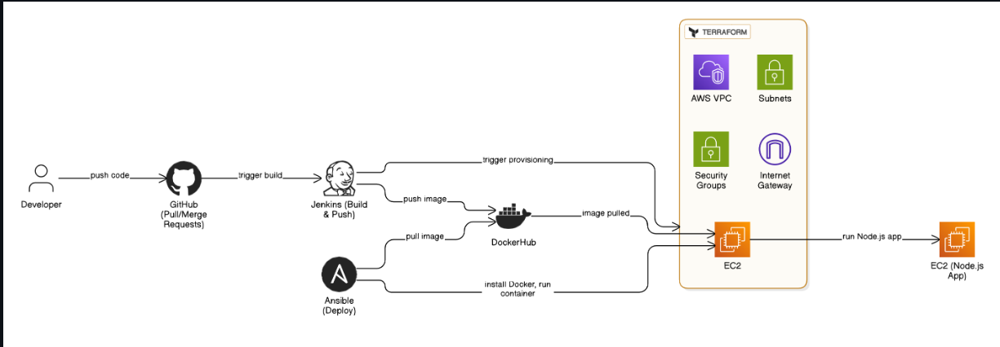
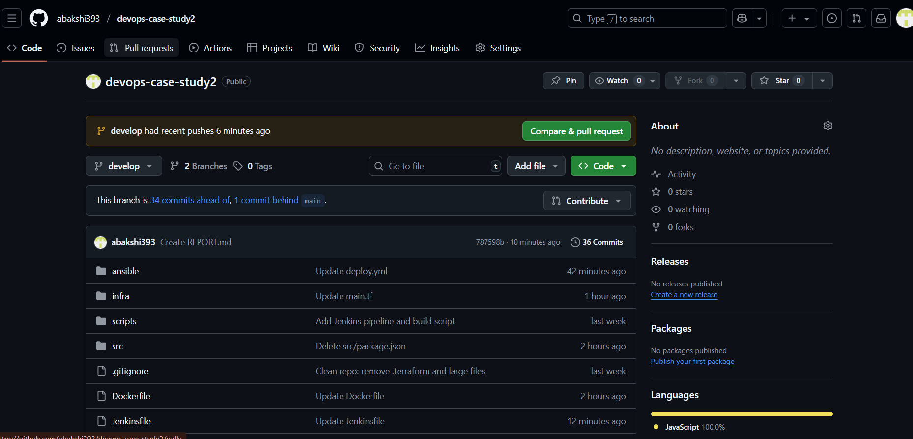
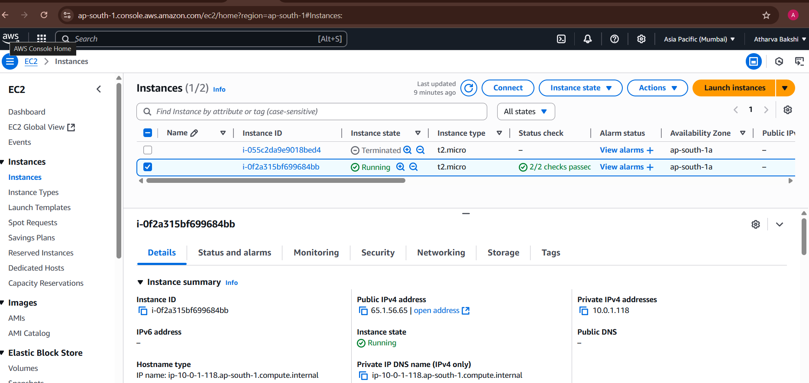
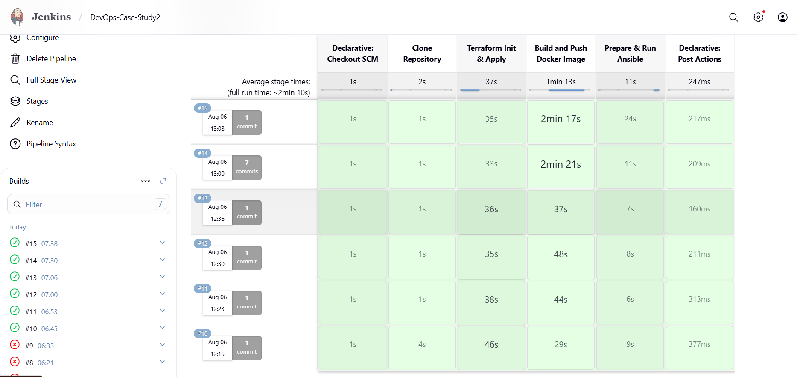
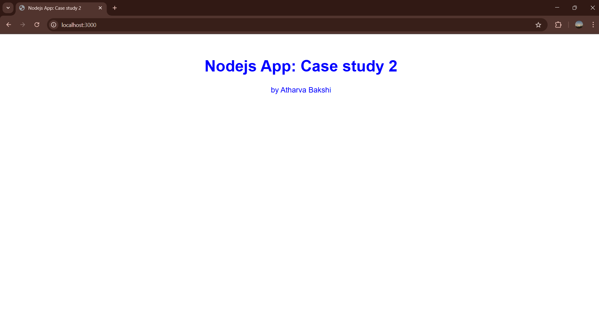

# 📄 DevOps Case Study - Final Report

This report documents the implementation of a fully automated DevOps CI/CD pipeline used to deploy a Node.js web application on AWS using Docker, Terraform, Ansible, Jenkins, Git and GitHub.

---

## 🔗 GitHub Repository

🔗 **Repository URL**: https://github.com/abakshi393/devops-case-study2.git 
📌 Branch Used: `develop`  
🛠️ All scripts, configs, Terraform files, and Jenkinsfile are included.

---

## 1️⃣ Architecture Diagram



**Flow Summary:**
- Code is pushed to GitHub → Pull/Merge Requests are created
- Jenkins clones the repository → Builds Docker image
- Image is pushed to DockerHub
- Terraform provisions infrastructure on AWS
- Ansible installs Docker on EC2, pulls image from DockerHub, and runs the container
- The Node.js app is deployed and accessible on AWS

---

## 2️⃣ Branching Strategy

### Strategy Followed:
- `main`: Protected branch, for production-ready code only
- `develop`: All development happens here, integrated via PRs

### GitHub Protection:
- Pull requests are enforced for merging into `main`
- Review-based merges demonstrate GitHub collaboration and control
  


---

## 3️⃣ Terraform Resource Summary

**Terraform Modules (in `infra/` folder):**

| Component         | Description                                      |
|------------------|--------------------------------------------------|
| **VPC**          | Custom VPC with a public subnet                  |
| **EC2 Instance** | One `t2.micro` instance (Free Tier)              |
| **Elastic IP**   | Static IP associated with EC2 for public access |
| **Security Group** | Inbound: SSH (22), HTTP (80)                    |

### Commands Used:
```bash
cd infra
terraform init
terraform apply -auto-approve
```


---

## 4️⃣ Pipeline Execution (Jenkins)

- Jenkins was used to automate the CI/CD process.
- Stages: checkout, build, terraform, deploy
- Screenshot:
  


---

## 5️⃣ Web Application Output

This is the final output of the deployed Node.js web application running on the AWS EC2 instance. The application was accessed via the public IP on port 80 after successful deployment using Jenkins, Terraform, Docker, and Ansible.

📷 **Deployed App Screenshot**  



